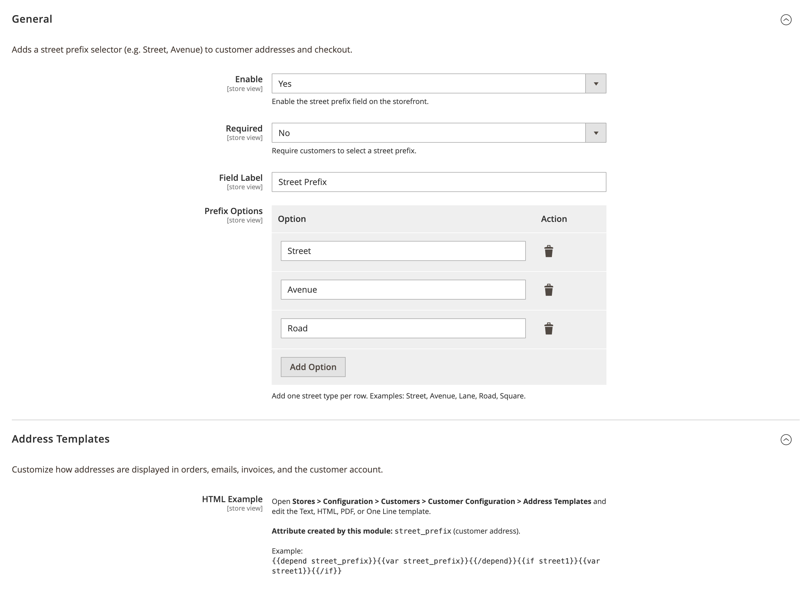
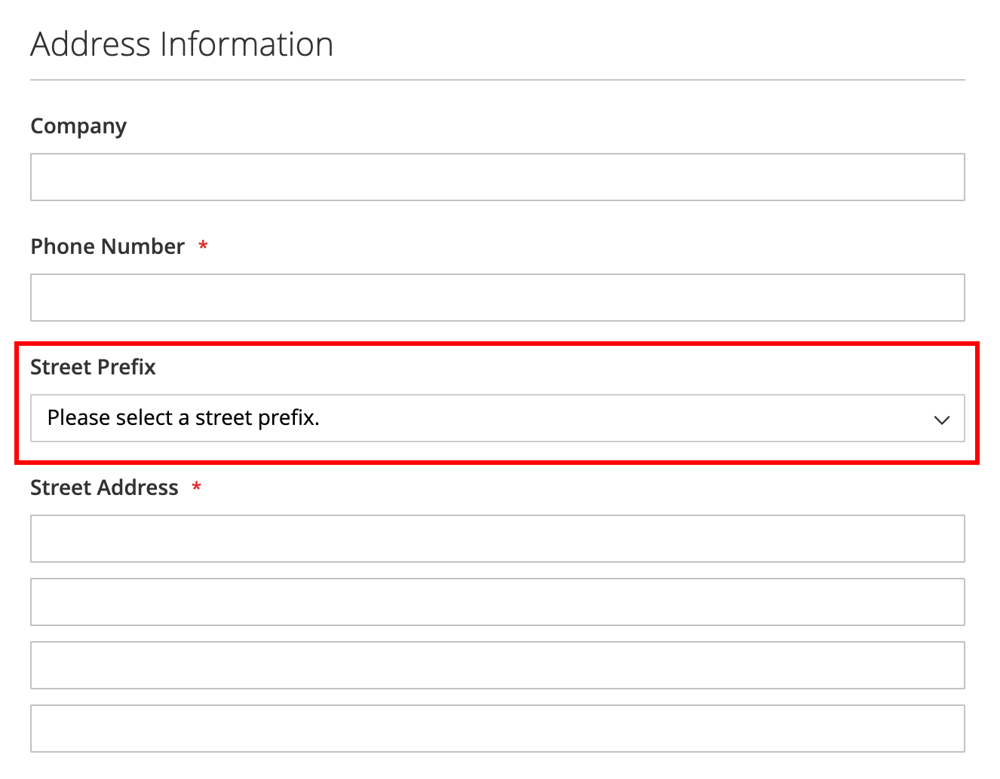
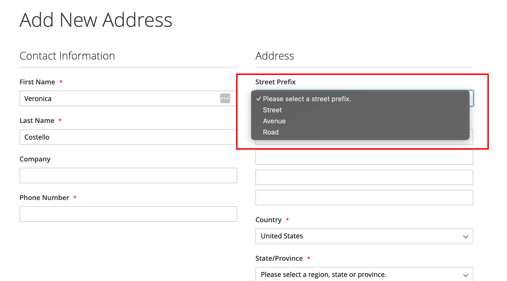
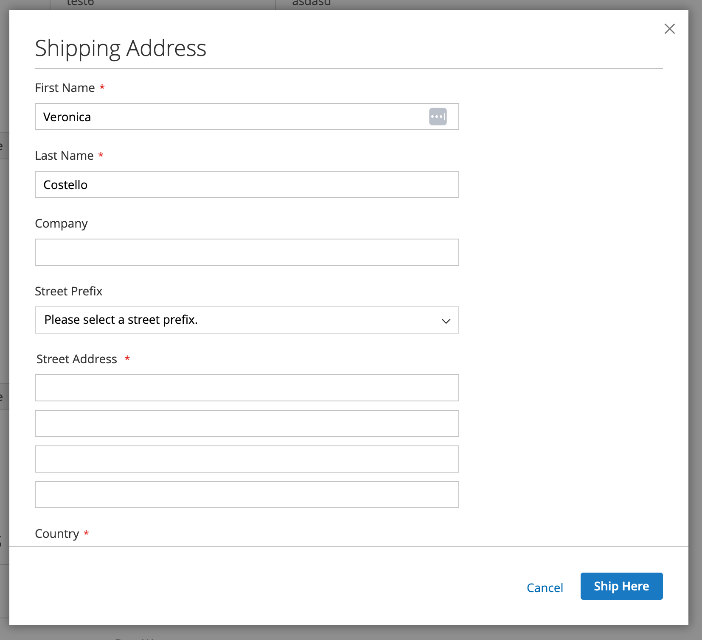

# System Code Street Prefix

## About Module

Adds a configurable street prefix selector (e.g. Street, Avenue, Lane) to customer and checkout address forms. Supports custom labels, required validation, admin-defined options, and address template variables for orders, emails, and invoices.

### Configuration

**Stores > Configuration > System Code > Street Prefix**

### Screenshots

#### Admin Configuration


#### Customer Registration


#### My Account — Address Book


#### Checkout


### Requirements

- `systemcode/base`
- `systemcode/customer`
- `magento/module-customer`
- `magento/module-checkout`
- `magento/module-quote`
- `magento/module-sales`

### How to install

#### ✓ Install by Composer (recommended)
```
composer require systemcode/base systemcode/customer systemcode/customer-street-prefix
php bin/magento module:enable SystemCode_CustomerStreetPrefix
php bin/magento setup:upgrade
```

#### ✓ Install Manually
- Copy module to folder `app/code/SystemCode/CustomerStreetPrefix` and run commands:
```
php bin/magento module:enable SystemCode_CustomerStreetPrefix
php bin/magento setup:di:compile
php bin/magento setup:upgrade
```

### License
OSL-3.0

### Authors
* [Eduardo Diogo Dias](https://github.com/eduardoddias)


---


## Sobre o Módulo

Adiciona um seletor configurável de prefixo de logradouro (ex.: Rua, Avenida, Alameda) nos formulários de endereço do cliente e checkout. Suporta rótulo personalizado, validação obrigatória, opções definidas no admin e variáveis para modelos de endereço em pedidos, e-mails e faturas.

### Configuração

**Lojas > Configuração > System Code > Street Prefix**

### Screenshots

#### Configuração no Admin


#### Cadastro de Cliente


#### Minha Conta — Catálogo de Endereços


#### Checkout


### Requisitos

- `systemcode/base`
- `systemcode/customer`
- `magento/module-customer`
- `magento/module-checkout`
- `magento/module-quote`
- `magento/module-sales`

### Como Instalar

#### ✓ Instalação via Composer (recomendado)
```
composer require systemcode/base systemcode/customer systemcode/customer-street-prefix
php bin/magento module:enable SystemCode_CustomerStreetPrefix
php bin/magento setup:upgrade
```

#### ✓ Instalação Manual
- Copie o módulo para `app/code/SystemCode/CustomerStreetPrefix` e execute:
```
php bin/magento module:enable SystemCode_CustomerStreetPrefix
php bin/magento setup:di:compile
php bin/magento setup:upgrade
```

### Licença
OSL-3.0

### Autores
* [Eduardo Diogo Dias](https://github.com/eduardoddias)
